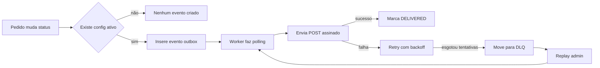
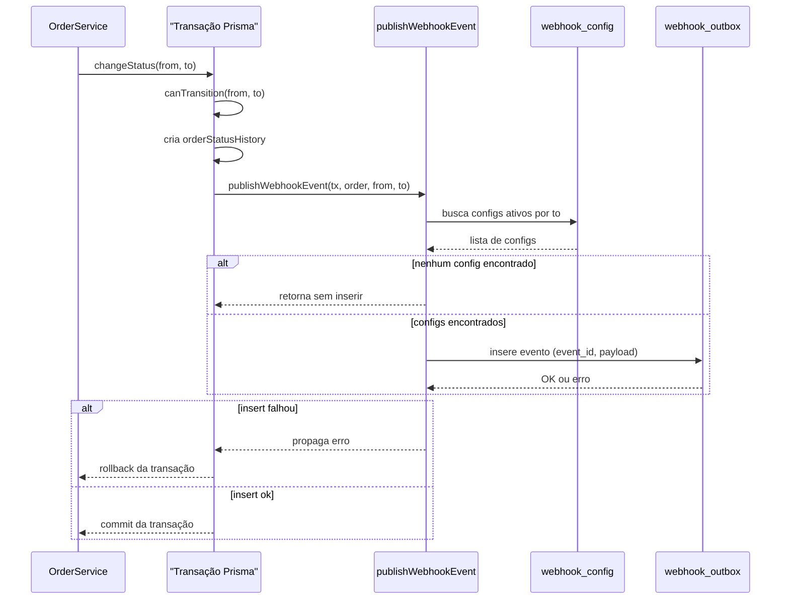
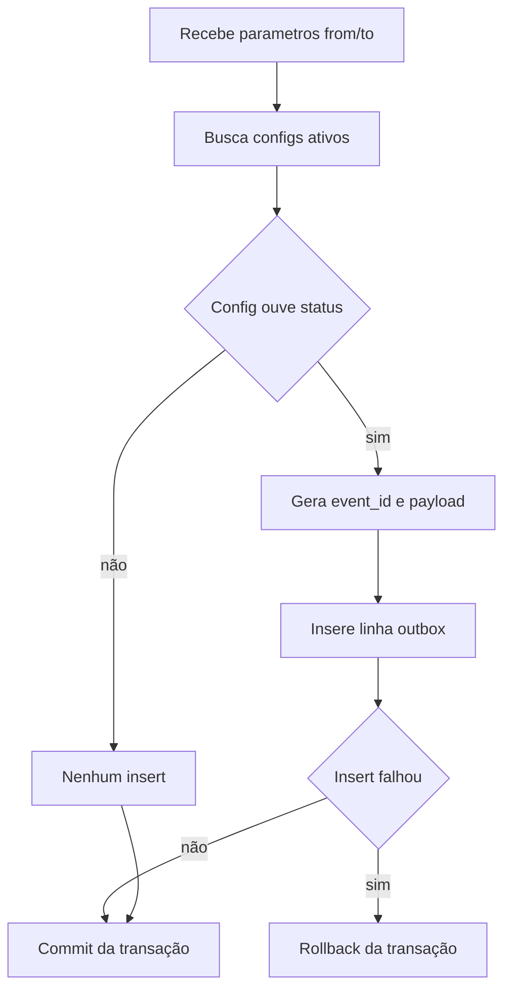
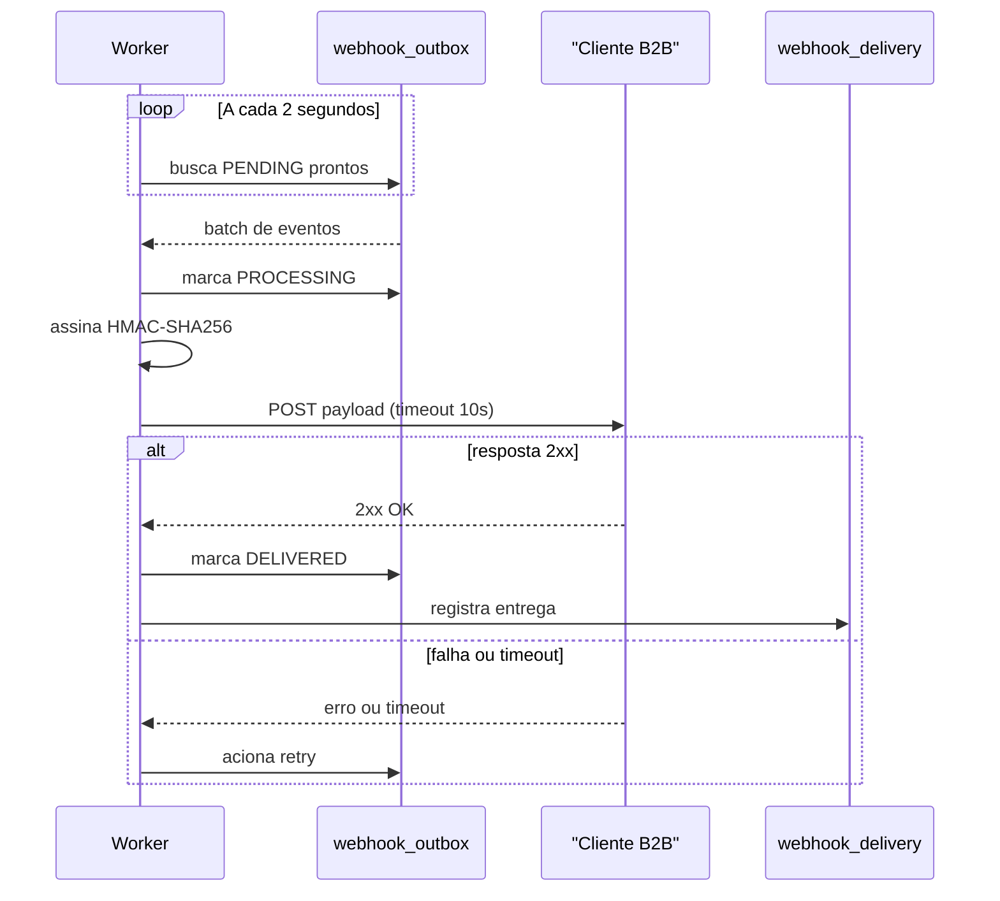
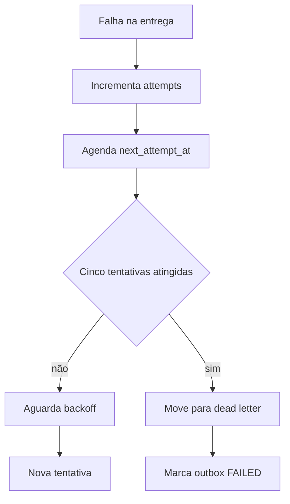
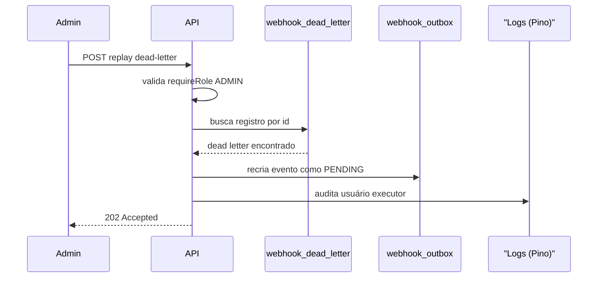
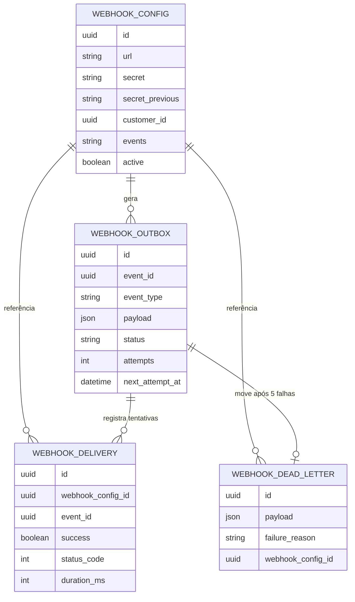

# Diagramas Mermaid - Sistema de Webhooks de Notificação de Pedidos

## Visão Geral

O sistema adiciona notificação externa via webhooks HTTP quando o status de um pedido muda no OMS.
A solução usa o padrão Outbox: o evento é gravado na mesma transação Prisma de `changeStatus` e
entregue de forma assíncrona por um worker dedicado (`src/worker.ts`), com retry exponencial e DLQ
para clientes indisponíveis. Toda entrega é assinada com HMAC-SHA256 e identificada por um
`event_id` único, garantindo entrega at-least-once com deduplicação pelo cliente.

## Elementos Identificados

### Fluxos externos

- Cliente B2B recebendo `POST {config.url}` assinado (HMAC-SHA256) com headers `X-Event-Id`,
  `X-Webhook-Id`, `X-Signature`, `X-Timestamp`.
- Endpoints públicos: `POST /webhooks`, `PATCH /webhooks/:id`, `GET /webhooks`,
  `GET /webhooks/:id/deliveries`, `POST /webhooks/:id/rotate-secret`.
- Endpoint administrativo: `POST /admin/webhooks/dead-letter/:id/replay` (role `ADMIN`).
- Autenticação via `authenticate` (CRUD) e `requireRole('ADMIN')` (replay).

### Processos internos

- `OrderService.changeStatus` executando dentro de uma transação Prisma.
- `canTransition` validando a transição de status (`order.status.ts`).
- `publishWebhookEvent(tx, order, from, to)` criando o evento na outbox.
- Worker (`src/worker.ts`) com loop de polling a cada 2s e `PrismaClient` próprio.
- Assinatura HMAC-SHA256 e envio HTTP com timeout de 10s.
- Retry com backoff exponencial e movimentação para `webhook_dead_letter`.
- Replay administrativo recriando o evento como `PENDING`.

### Variações de comportamento

- Existência ou não de `webhook_config` ativo cujo `events` inclui o status de destino.
- Resposta `2xx` (sucesso) versus falha (status >= 400, timeout, erro de rede).
- Número de tentativas menor que 5 (retry) versus igual a 5 (movimentação para DLQ).
- Rotação de secret: `secret` atual versus `secret_previous` válida por 24h.

### Contratos públicos

- `POST /webhooks`, `PATCH /webhooks/:id`, `GET /webhooks`, `GET /webhooks/:id/deliveries`,
  `POST /webhooks/:id/rotate-secret`.
- `POST /admin/webhooks/dead-letter/:id/replay`.
- Payload outbound `order.status_changed` enviado ao cliente.
- Família de erros `WEBHOOK_*`, subclasses de `AppError`.

## Diagramas

### Visão Geral do Fluxo

Este flowchart apresenta o caminho ponta a ponta do sistema, desde a mudança de status do pedido
até a entrega confirmada no cliente, incluindo os desvios de retry e DLQ. É o ponto de partida
recomendado para entender a arquitetura antes de aprofundar em cada etapa, pois conecta o padrão
Outbox, o worker assíncrono e o mecanismo de resiliência em uma única imagem. Use este diagrama
para explicar o desenho geral a alguém que ainda não conhece o sistema.

**Notas**:

- A verificação de config ativo evita gravar linhas desnecessárias na outbox quando nenhum
  cliente está inscrito naquele status.
- O ciclo de retry e o replay administrativo realimentam o worker, fechando o loop de entrega.

---

### Criação do Evento na Outbox

Este diagrama de sequência detalha o trecho mais crítico do sistema: a inserção do evento de
webhook dentro da mesma transação Prisma que muda o status do pedido. Ele mostra como
`publishWebhookEvent` consulta as configurações ativas, decide se insere ou não o evento, e como
uma falha no insert provoca rollback de toda a transação de `changeStatus`. É essencial para
entender a garantia de atomicidade que fundamenta o padrão Outbox adotado.

**Notas**:

- A chamada ocorre entre a criação do histórico e o `refreshed`, dentro da mesma transação.
- Se nenhum `webhook_config` ativo ouvir o status de destino, nenhuma linha é inserida.
- Falha no insert derruba a transação inteira: o status não muda sem o evento correspondente.

---

### Lógica de publishWebhookEvent

Este flowchart isola a lógica de decisão dentro de `publishWebhookEvent`, complementando o
diagrama de sequência anterior com uma visão de algoritmo. Ele é relevante porque a FDD aponta uma
armadilha de implementação: neste ponto da transação, `order.status` ainda contém o valor antigo,
então a lógica deve sempre usar os parâmetros `from`/`to` recebidos, nunca reler o objeto `order`.
Use este diagrama ao implementar ou revisar a função para evitar esse erro sutil.

**Notas**:

- A decisão de "config ouve status" usa o parâmetro `to`, e não uma releitura de `order.status`,
  que ainda estaria com o valor antigo neste ponto da transação.
- O `payload` é renderizado como snapshot no momento do insert, não recalculado depois.

---

### Processamento e Entrega pelo Worker

Este diagrama de sequência mostra o ciclo de vida de um evento depois que ele chega à outbox: o
worker dedicado faz polling periódico, assina o payload com HMAC-SHA256 e realiza a entrega HTTP
com timeout de 10s. Ele é fundamental para entender como o sistema desacopla a entrega externa da
transação crítica de pedidos, e como o resultado da chamada determina se o evento é marcado como
entregue ou encaminhado ao fluxo de retry.

**Notas**:

- O worker roda em processo separado, com `PrismaClient` próprio, buscando eventos
  `PENDING` com `next_attempt_at <= now`, ordenados por `created_at`, em lote pequeno.
- Qualquer resposta diferente de `2xx` ou timeout de 10s é tratada como falha.

---

### Retry, Backoff e DLQ

Este flowchart descreve o mecanismo de resiliência acionado quando uma entrega falha: o número de
tentativas é incrementado, um novo horário de tentativa é agendado segundo o backoff exponencial, e
ao atingir o limite de tentativas o evento é movido para a dead letter. Este é um dos pontos mais
importantes do sistema para garantir que falhas transitórias de clientes não causem perda de
eventos, e para deixar claro quando a intervenção manual via replay se torna necessária.

**Notas**:

- O backoff segue a sequência `1m / 5m / 30m / 2h / 12h` entre tentativas.
- Ao atingir 5 tentativas sem sucesso, o evento é gravado em `webhook_dead_letter` com
  `failure_reason`, e a outbox é marcada como `FAILED`.

---

### Replay de Dead Letter

Este diagrama de sequência ilustra o único caminho de recuperação manual do sistema: um
administrador aciona o endpoint de replay para recriar, na outbox, um evento que havia esgotado
todas as tentativas automáticas. É relevante porque envolve controle de acesso (`role ADMIN`) e
auditoria explícita de quem executou a ação, dois requisitos de segurança destacados na FDD.

**Notas**:

- O endpoint exige `requireRole('ADMIN')`, diferente dos demais endpoints de CRUD que exigem
  apenas `authenticate`.
- A execução do replay é registrada em log para fins de auditoria.

---

### Modelo de Dados

Este diagrama de entidade-relacionamento apresenta as quatro novas tabelas introduzidas pela
feature e como elas se relacionam: uma configuração de webhook gera eventos na outbox, pode
acumular registros de entrega e, em caso de falhas esgotadas, ter eventos movidos para a dead
letter. Este diagrama é essencial para qualquer trabalho de migração de banco ou implementação do
schema Prisma, servindo como referência estrutural complementar aos fluxos de processo.

**Notas**:

- Todas as tabelas seguem o padrão do projeto de PK `id` em UUID.
- O detalhamento completo de colunas fica a cargo da implementação; este diagrama reflete a
  visão geral descrita na FDD.
- `status` em `webhook_outbox` assume os valores `PENDING`, `PROCESSING`, `DELIVERED` ou `FAILED`.

---
